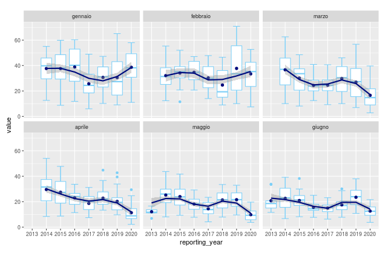

# Introduzione
Lorem ipsum dolor sit amet, consectetur adipiscing elit. Curabitur pulvinar tincidunt nisl. Proin sit amet porta tortor. Phasellus finibus congue laoreet. Aenean venenatis, nisl eu maximus condimentum, ligula ligula finibus mi, a placerat risus lectus aliquet libero. Integer consectetur convallis purus vitae blandit. Aliquam in erat a dolor sodales porttitor. Suspendisse potenti. Duis ut nisl sem.

## Donec ut elementum orci
Vivamus mollis libero et ligula pharetra, quis congue metus aliquet. Aliquam laoreet dolor ut ante scelerisque ultricies. Sed sed dolor vitae dolor malesuada vehicula. Sed auctor, risus et laoreet consectetur, massa orci placerat felis, eget facilisis ligula ex ac risus. Donec id laoreet tellus. Nunc scelerisque arcu id tellus rhoncus, scelerisque malesuada ex semper.

### Vivamus sit amet velit 
Lorem ipsum dolor sit amet, consectetur adipiscing elit. Curabitur pulvinar tincidunt nisl. Proin sit amet porta tortor.

  
Figura 1. Mappa
  

## Outputs
### Time series
Lorem ipsum dolor sit amet, consectetur adipiscing elit. Curabitur pulvinar tincidunt nisl. Proin sit amet porta tortor. Phasellus finibus congue laoreet. Aenean venenatis, nisl eu maximus condimentum, ligula ligula finibus mi, a placerat risus lectus aliquet libero. Integer consectetur convallis purus vitae blandit. Aliquam in erat a dolor sodales porttitor. Suspendisse potenti. Duis ut nisl sem.

 
Figure 2. Lorem ipsum dolor sit amet.
  

#### Boxplot
Lorem ipsum dolor sit amet, consectetur adipiscing elit. Curabitur pulvinar tincidunt nisl. Proin sit amet porta tortor. Phasellus finibus congue laoreet. Aenean venenatis, nisl eu maximus condimentum, ligula ligula finibus mi, a placerat risus lectus aliquet libero. 

 
Figure 3. Lorem ipsum dolor sit amet.
  

#### Pollution rose
Lorem ipsum dolor sit amet, consectetur adipiscing elit. Curabitur pulvinar tincidunt nisl. Proin sit amet porta tortor. Phasellus finibus congue laoreet. Aenean venenatis, nisl eu maximus condimentum, ligula ligula finibus mi, a placerat risus lectus aliquet libero. 

  
Figure 3. Lorem ipsum dolor sit amet, consectetur adipiscing elit. Curabitur pulvinar tincidunt nisl. Proin sit amet porta tortor.
  

#### Polar plot
Lorem ipsum dolor sit amet, consectetur adipiscing elit. Curabitur pulvinar tincidunt nisl. Proin sit amet porta tortor. Phasellus finibus congue laoreet. Aenean venenatis, nisl eu maximus condimentum, ligula ligula finibus mi, a placerat risus lectus aliquet libero. 

  
Figure 4. Lorem ipsum dolor sit amet.
  

## Package dependencies & credits
Lorem ipsum dolor sit amet, consectetur adipiscing elit. Curabitur pulvinar tincidunt nisl. Proin sit amet porta tortor. Phasellus finibus congue laoreet. Aenean venenatis, nisl eu maximus condimentum, ligula ligula finibus mi, a placerat risus lectus aliquet libero.

## Help & feedback
For additional help or to submit feedback or bug reports, please contact:  
ISPRA  06 5007 1
pulvirus@isprambiente.it
